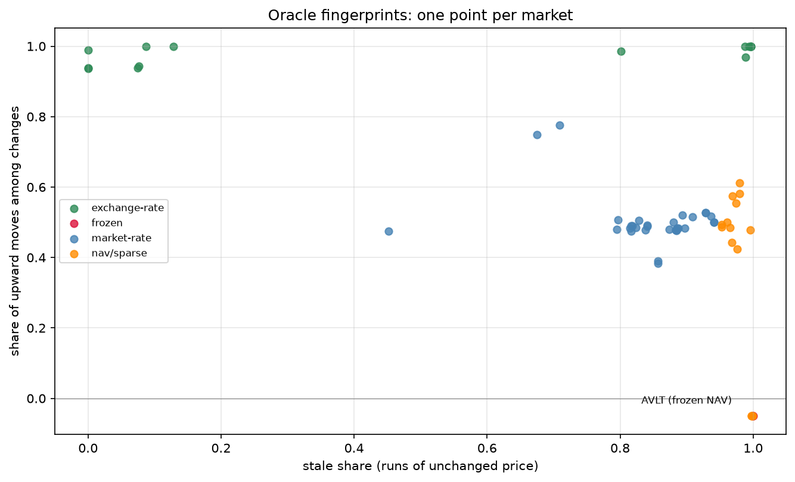
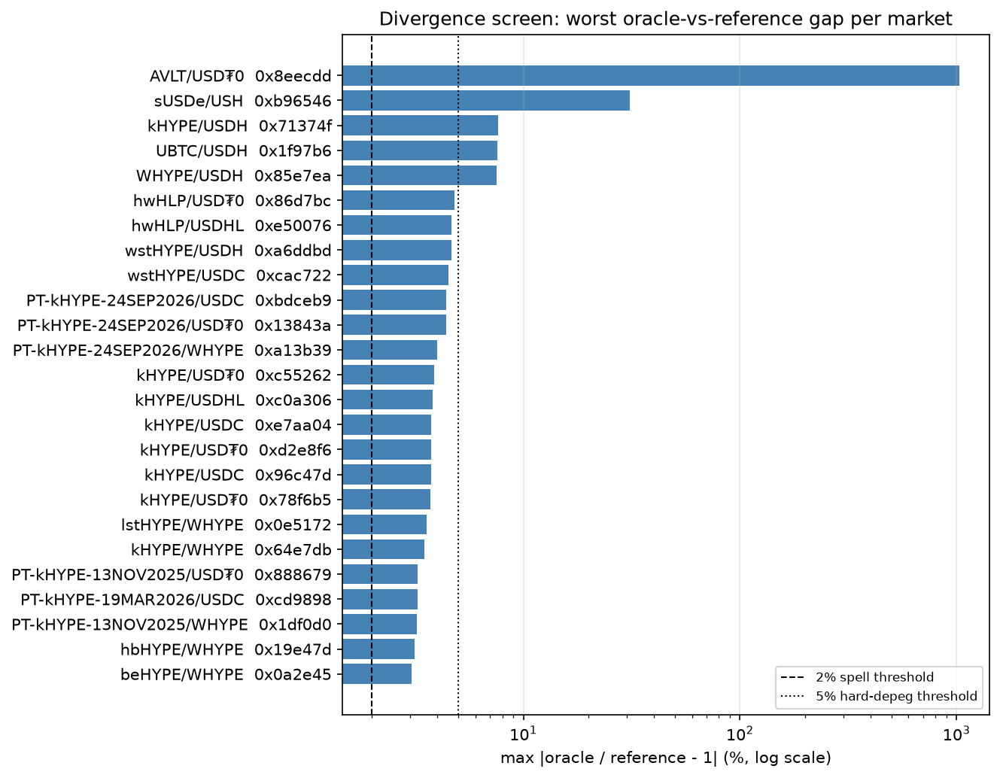

# 01 — Oracle census

## Question

How does each oracle on the tracked HyperEVM markets behave? We measure
update cadence, direction, volatility, and divergence from a reference
price. Which markets show true staleness, assertion pricing, or depeg
signatures?

This loop does not try to predict issuer failure. The one bad-debt event on
HyperEVM (AVLT/USDT0) came from an issuer-NAV oracle that operated as
designed. The published value stopped being true. No statistic can detect
this before it occurs. The loop measures two things that data can show.
First, which markets get their price from issuer assertion and not from
market discovery. Second, which oracles diverge from an observable market
price. The second class includes an exchange-rate oracle that asserts par
through a real market depeg.

## Data

The MNEMON snapshot is pinned in `manifest.json`. It holds 5-minute
`market_state` for the tracked HyperEVM markets, the `markets` dimension,
token USD reference prices (`prices`: DeFiLlama with Morpho-API fallback),
and `market_flows` (complete per-account event history, used by the AVLT
anatomy). Oracle prices exist on live rows only, from 2026-07; each
fingerprint uses about five weeks of 5-minute samples. Utilization, supply,
and borrow extend back to market creation through backfill. The loop
CLAUDE.md records coverage boundaries and known feed gaps.

The 5-minute snapshots show price changes, not on-chain update events. In
this loop, "staleness" means a run of unchanged observed prices. The oracle
updates in discrete steps, so 5-minute sampling loses little. The reference
price moves continuously, and its samples are 15 minutes (live) or 1 hour
(historical) apart. The divergence screen can only resolve divergences that
last at least one reference interval. It joins the oracle to the last known
reference point (ASOF join). It treats shorter divergences as noise. Flash
depegs are out of scope.

## Method

Three lanes. SQL extracts data. METRON computes statistics.

1. **Fingerprint census.** For each market, we take `oracle_price` from
   `v_market_state`. `staleness_stats` measures runs of unchanged price.
   `realized_vol` measures the volatility of oracle log-returns. We tabulate
   the share of upward moves by hand (`# TODO(metron): add direction_stats`).
   Output: each market gets one class — market-rate, exchange-rate,
   NAV-assertion, or PT-decay.
2. **Divergence screen.** `deviation_vs_reference` compares the
   oracle-implied collateral/loan ratio to the reference USD-price ratio,
   where reference coverage exists. Persistent divergence indicates
   assertion pricing. Sudden divergence indicates a depeg. A frozen
   reference is a data gap, not a signal.
3. **Calibration anatomy.** AVLT/USDT0 through its 2026-06-21 depeg is the
   known-positive case. We use the reference-price path, the loan-side
   flows, and the oracle's frozen assertion gap. PT-decay markets are the
   known-benign control: they look stale but are correct.

Loop 02 covers exit dynamics.

## Results

The results appear in the order the lanes ran. Each finding states what we
measured, what the numbers say, and what question it opens for the next
lane. All numbers come from `notebook.ipynb`; the charts are saved by the
notebook into `assets/`.

### Finding 1 — Behavior alone classifies every oracle

The census fingerprints 63 markets, each with about 5,700 to 7,800
five-minute samples. Four behavior classes separate cleanly. 32 markets are
market-rate: sparse two-sided heartbeats (UBTC, UETH, WHYPE families; stale
share 0.8–0.96; up-share near 0.5). 14 are exchange-rate: accrual oracles
with 90% or more of their changes upward (LSTs, hbUSDT). 14 are NAV/sparse.
3 are frozen: AVLT with zero changes in 5,725 samples and a 19.9-day stale
stretch; hbHYPE/WHYPE and the matured PT-13NOV2025 at 31.8 days.

Live PT markets update at every sample, almost monotonically. They look
stale by reputation but measure as benign. The reverse also holds: the
heartbeat oracles look stale (few changes) but are two-sided and correct.

Reading: two numbers — stale share and up-move share — separate the four
classes without reading a contract. But the classes only describe behavior.
They do not say which oracle publishes a wrong value. That needs a market
price to compare against, which is finding 2.

### Finding 2 — The divergence screen finds real events at every severity

We compare each oracle to its DeFiLlama reference. The worst gaps per
market, with the 2% and 5% spell thresholds:

In order of severity. AVLT/USDT0: time-weighted mean deviation +194%,
maximum +1035% — a frozen NAV against a collapsing market price. sUSDe/USH:
mean −17.6%, maximum 31%, one 8-day spell above 5% — here the loan token
(USH) depegged, which shows the screen catches either leg, and the sign
tells which. USDH markets: a 7.6% peak across short spells. kHYPE: a market
dip of about 3.9% on 2026-07-29, which every kHYPE exchange-rate oracle
asserted par through — the exact failure class this screen exists for, at a
survivable size. New in this run: hwHLP moved to 4.8% against its reference
on 2026-08-09, with one 27-hour spell above 2% — the screen caught a live
event during the census refresh. Structural premia (thBILL, 2.3% peak) are
persistent and stable: features to model, not alerts.

Reading: divergence, not staleness, separates harmful from benign. The
screen works as a standing alert. The worst case on the chart is AVLT —
finding 3 dissects what its gap did to the market.

### Finding 3 — AVLT: the assertion gap in motion

The reference price shows the depeg arc: weekly medians of 1.08–1.09
through 2026-06-15, then 0.80, 0.69 after 2026-06-22, and 0.27–0.47 in
August. The oracle still publishes 1.0945. Borrows accelerated into the
depeg: 4.2M USDT0 in the week of 2026-06-21. To deposit NAV-marked
collateral and borrow against it was the rational exit. 7.5M of the 9.8M
supplied USDT0 escaped in a four-week supply/repay rotation. The trapped
remainder now grows by itself: 2.21M in late July, 2.49M at this snapshot,
because interest accrues at 100% utilization with no repayment.

Reading: an assertion-priced market does not fail quietly. It transfers
value to whoever borrows against the false mark first, and it locks the
remaining lenders into a growing claim on collateral that is not there.
Finding 4 tests the last line of defense: liquidations.

### Finding 4 — Liquidations fire at the false mark, and the loss metric reads zero

The frozen oracle did not block liquidations. 750 fired between 2026-06-25
and 2026-08-02, with 5.2M USDT0 repaid; one address did 67% of it. Each one
executed at the frozen oracle mark: the implied seize price of 1.06658
equals oracle / LIF for LLTV 0.915, exact to five decimals. Interest accrual
is the trigger, not collateral repricing. Liquidations stopped after late
July: zero fired in the last two weeks of the sample, while the median
borrower health factor fell from 0.776 to 0.539 across 253 borrowers. To
repay real USDT0 for collateral marked about four times above market is a
certain loss to the liquidator, so almost nobody does it. Recorded bad debt
for this market remains zero. The chain-wide all-time total is 141 events
and about $185.

Reading: Morpho records bad debt only when a liquidation exhausts a
position's collateral and debt remains. At an inflated mark, the collateral
always appears sufficient, so the shortfall is never recorded — it transfers
to the liquidator, and when liquidators stop volunteering, it just accrues.
The standard risk metric is blind to exactly this failure class.

## Conclusion

The conclusion follows from the findings above. From finding 1: five weeks
of live oracle data classify every HyperEVM oracle by behavior, without
reading a contract. From finding 2: the divergence screen finds real events
at every severity — a frozen NAV (AVLT), a loan-token depeg (USH), an LST
dip asserted away (kHYPE), and a live hwHLP drift caught during this run —
so persistent |deviation| ≥ 2% on a market-priced leg works as a standing
alert. From findings 3 and 4: the most important result concerns the metric,
not the markets. An assertion-priced oracle transfers the loss instead of
recording it — first to fast borrowers, then to volunteering liquidators,
and finally to trapped lenders whose claim grows by accrual — while recorded
bad debt reads zero throughout. Exposure accounting must therefore weight
markets by oracle class: collateral priced by issuer assertion is
unpriceable risk, whatever its recorded history. Staleness alone is not a
signal. The most stale-looking healthy oracles (live PTs, heartbeat feeds)
are benign by construction, and the divergence screen — not the staleness
screen — is the alert worth running.
