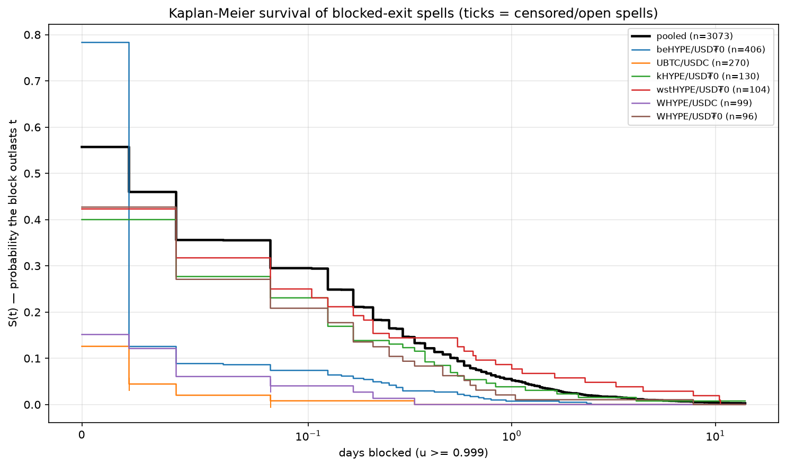
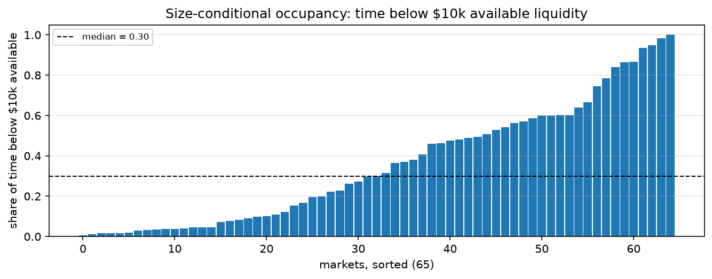
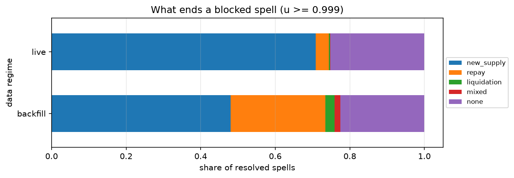

# 02 — Exit liquidity

## Question

When a lender wants out of a HyperEVM market, how long does the wait last,
what ends it, and who owns the door?

Scope: every tracked HyperEVM market with utilization history. This is a
census of the whole chain, not a study of pre-selected markets. HEGEMON V1
history is out of scope (no event sink existed).

## Data

The MNEMON snapshot is pinned in `manifest.json`. It holds `market_state`
(utilization, supply, borrow — 5-minute live sampling, hourly backfill to
market creation), the `markets` dimension, `market_flows` (complete
per-account, per-transaction event history), `prices` (USD reference), and
`supplier_positions` (hourly lender-book snapshots). The loop consumes these
views: `v_exit_spells` (episodes of u ≥ 0.99 / 0.999 with 2-hour hole
tolerance), `v_market_flows` (signed loan-side flows in token units),
`v_market_health` (available liquidity in USD), and `v_market_state`.

Four caveats set the limits of the data:

1. Backfill sampling is hourly, and the spell view tolerates 2-hour holes.
   Spells shorter than one to two hours are not visible before a market's
   live 5-minute capture begins. Lane 1 output is stratified by data regime.
   A spell is live-era when it starts at or after the market's first
   sub-30-minute sampling gap. All other spells are backfill-era.
2. `supplier_positions` exists only from late in the sample. All historical
   lender books come from flow reconstruction. The snapshots serve only as a
   cross-check of the reconstruction on the overlap period. We report a
   material discrepancy; we do not absorb it silently.
3. Open spells are right-censored (observed = False). All survival numbers
   are Kaplan-Meier estimates. When a market's largest observation is
   censored, the curve flattens there. S beyond that point is a lower bound.
   The census table flags these markets.
4. `market_flows` is complete event history since 2025-04-25. No tracked
   market on this chain predates that date. Flow-reconstructed books are
   therefore available for every spell.

## Method

Definitions. Exit is BLOCKED when u ≥ 0.999. At that level a withdrawal of
any size reverts or waits. This matches the pinned_util definition in
`v_market_health`. The tier u ≥ 0.99 is the near-blocked sensitivity tier.
Below these tiers, stuckness depends on position size. We measure it as
occupancy of low-available-liquidity states, not as spells. The 0.92 / 0.95
tiers of `v_util_spells` are HEGEMON operational thresholds. This loop does
not use them.

Three lanes, run in sequence. SQL extracts data. METRON computes statistics.

### Lane 1 — Blocked-spell census

We take `v_exit_spells` over the full backfilled history, per market and
pooled. The ≥ 0.999 tier is the primary object. The ≥ 0.99 tier is the
sensitivity check. A spell is open when its end reaches the market's last
sample within the 2-hour hole tolerance. Open spells are right-censored:
observed = False, duration = snapshot_ts − spell_start. We never drop or
truncate an open spell. METRON `spell_stats` and `empirical_survival`
(horizons 1h, 6h, 24h, 72h, 168h) run per market and pooled on the ≥ 0.999
tier. The census reports per market: n spells, n open, median and p90
resolved duration, S(24h), S(168h).

Size-conditional occupancy. METRON `occupancy_below` (added in v1.2.0 for
this lane) computes the rule-5 time-weighted share of time available
liquidity sits strictly below $1k / $10k / $100k. The input series is
`available_usd` from `v_market_health` (ASOF-priced). Rows without a price
are excluded at extraction.

### Lane 2 — Resolution anatomy

For every resolved ≥ 0.999 spell, we classify the ending mechanism from
loan-side flows in a terminal window. The drafted window was
[spell_end − 2h, spell_end]. That window cannot contain the resolving event:
end_ts is the last sample ABOVE the threshold, so the resolving flow arrives
between end_ts and the next sample. The window used is
[end − 2h, min(next_state_ts, end + 2h)]. The loop CLAUDE.md records the
measurement behind this change.

Classification rules, in order of precedence:

- a Liquidation event in the window → "liquidation";
- net borrow_flow < 0 and dominant in magnitude → "repay";
- net supply_flow > 0 and dominant → "new_supply";
- both flows material — each side's magnitude > 25% of the larger →
  "mixed".

Magnitudes are loan-token units from `v_market_flows`. The classification is
per-row algebra plus these thresholds. It runs in notebook pandas, not in
METRON.

IKR filter. A flashloan-funded Supply paired with an offsetting vault-side
Withdraw in the same tx_hash is a Vault V2 in-kind redemption. It transfers
exposure; it does not exit or resolve anything. Before any gross-flow tally,
we tag same-tx_hash loan-side Supply/Withdraw pairs with amounts equal
within 1 basis point as `is_ikr`. Lane 2 excludes these rows. Lane 3 uses
them.

IRM-as-exit-pump, for spells classified "repay": we compare
`rate_at_target` at spell start and spell end (ASOF join on `market_state`)
and the elapsed time. We report the distribution of rate multiples with
pandas describe only. Anything beyond that belongs upstream in METRON.

### Lane 3 — Door concentration

Two HHI computations per ≥ 0.999 spell (METRON `hhi`):

1. withdrawal amounts by account during the spell window, loan side,
   excluding `is_ikr` rows;
2. the lender book at spell start. We reconstruct it from cumulative signed
   loan-side supply flows per account up to spell_start. We convert each
   flow to shares at event time with an ASOF join on `market_state`
   (shares = assets × supply_shares / supply_assets at the nearest state row
   at or before the event). HHI runs on net positive shares. The conversion
   is per-row algebra in SQL/pandas, not in METRON.

Exit-class split, all markets: per spell window, we report withdrawn volume
in two classes — capacity-consuming (non-IKR withdrawals) and in-kind
(`is_ikr` pairs) — and the per-market in-kind share across all spells.

The optional permutation test of book-HHI against spell duration is cut from
this run (budget). See the loop CLAUDE.md.

## Results

The results appear in the order the lanes ran. Each finding states what we
measured, what the numbers say, and what question it opens for the next
lane. All numbers come from `notebook.ipynb`; the charts are saved by the
notebook into `assets/`.

### Finding 1 — Blocks are frequent, usually short, with a heavy tail

The data holds 3,073 blocked spells (u ≥ 0.999) across 64 markets; 7 are
open at the snapshot. The 0.99 sensitivity tier holds 3,520 spells. The two
tiers almost coincide: markets sit either below 0.99 or at 1.0, with almost
nothing between. Pooled over all spells, the median resolved block lasts 10
minutes and the p90 lasts 12 hours. Kaplan-Meier S(24h) = 5.2% and
S(168h) = 0.7%. The longest resolved block lasted 61.8 days.

Era stratification confirms the visibility floor, not a regime change:
backfill-era spells show S(1h) = 43.6% against 7.9% live-era. Hourly
sampling cannot see sub-hour spells, so the backfill-era distribution shifts
right by construction. The live-era curve is the truer picture of short
blocks. One market's survival numbers are lower bounds (its largest
observation is censored); the census table in the notebook flags it.

Reading: a block is not rare and is usually survivable. The risk sits in the
tail. This opens two questions. How much room does a lender of real size
have below the blocked tier (finding 2)? And what force ends a block
(finding 3)?

### Finding 2 — For a lender of size, the door is narrower than the spells show

65 markets have priced availability history. The median market sits below
$10k available liquidity 30.0% of the time (quartiles 7.8% and 57.2%),
below $1k 7.7% of the time, and below $100k 72.2% of the time. The extreme
is a kHYPE/USDT0 market below $10k for 100% of its history.

Reading: the blocked-spell count understates exit risk for any position of
real size. A market can stay formally unblocked and still offer less room
than one position needs, for most of its life. Position size against
available liquidity is a different, tighter constraint than the u ≥ 0.999
tier.

### Finding 3 — New money reopens the door; borrowers almost never do

Of 3,066 resolved spells: 53% end in new supply, 21% in repayment, 2% in
liquidation, 1% mixed. The remaining 23% show no attributable loan-side flow
in the terminal window. This residual is consistent with knife-edge
utilization ticks at the 0.999 boundary; the loop notes record the
hypothesis, and this loop does not resolve it.

The live-era mix is starker: 71% new_supply against 3.5% repay. The
IRM-as-pump effect is small at the median (rate multiple 1.011 at
resolution, p75 1.041) because most spells resolve within hours. The tail is
real (maximum multiple 37×). The ratchet does its work only on the blocks
that last.

Reading: blocked doors reopen because new money arrives. They almost never
reopen because borrowers leave. The protocol's own pump (the rate ratchet)
only matters on long blocks. So the exit option of a lender depends on the
market's power to attract deposits. That power is a property of the market
and its curators — which raises finding 4: who actually stands at the door?

### Finding 4 — One account owns the door

The withdrawal HHI during blocked spells has median 1.0 and p25 1.0. In at
least three quarters of spells with any capacity-consuming withdrawal, every
withdrawn coin left through one account. The lender book at spell start is
nearly as concentrated (median HHI 0.974, median 9 lenders). The books are
vault-intermediated. The door belongs to whoever runs the vault. In-kind
redemptions are negligible chain-wide (0.74% of gross Supply/Withdraw
volume) with one exception: AVLT/USDT0, where 87.6% of spell-window
withdrawal volume was in-kind (45.9M transferred against 6.5M
capacity-consuming). The post-depeg "exit" was mostly exposure transfer, not
exit.

Reading: exit is not a shared resource under stress. It is a queue of one or
two doors, and the doors are curators.

### Finding 5 — Caveat: books and withdrawal HHI are caller-level

Flow-reconstructed books match the supplier_positions snapshots within 1%
maximum share difference for five of eight checked markets, and within 10%
for two more. The one material divergence (UBTC/USDT0, 0.67 maximum share
difference) is attribution, not data loss. `market_flows` credits the
transaction caller. Positions accrue to `onBehalf`, which the flows API does
not expose. A router that supplied and withdrew 447M near-net-zero across 17
markets absorbs the book that belongs to its users. Reconstructed books are
therefore caller books. They are correct exactly where caller = owner — the
vault-dominated norm on this chain, which is why the other checks pass. The
router is material in two markets (UETH/USDT0 at 73% of spell-window
withdrawals, PT-hbUSDT-18DEC2025 at 20%). In those two, HHI = 1.0 overstates
owner-level concentration. Everywhere else the concentration reading is
genuine.

## Conclusion

The conclusion follows from the findings above. From finding 1: a blocked
exit is a frequent and usually short event with a thin, consequential tail —
the median block resolves within minutes, one in twenty outlasts a day, and
the longest ran two months. From finding 3: borrowers almost never reopen
the door (71% of live-era resolutions arrive as new supply against 3.5% as
repayment), and the IRM ratchet only matters on the blocks that last. Exit
liquidity on this chain is other people's entrance. A lender's true exit
option is the market's power to keep attracting deposits, not any behavior
of its debtors. From finding 4: the door itself is singular — in at least
three quarters of blocked spells, every withdrawn coin left through one
account, and the lender books behind them are vault-owned near-monopolies
(caller-level, per finding 5, genuine outside two router-heavy markets). For
a depositor, the practical question is not "can this market be exited". It
is "does my curator reach the door first". The one market where exits took
another route (AVLT, 88% in-kind) transferred exposure instead of ending it.
For HEGEMON the operational reading combines findings 1, 2 and 4.
Utilization thresholds identify blocks after the fact. The risk that matters
is standing in a single-door queue. Position size relative to available
liquidity — the median market offers less than $10k of it 30% of the time —
and relative to the other lender behind the same door is the exit-risk
variable worth engineering against.
