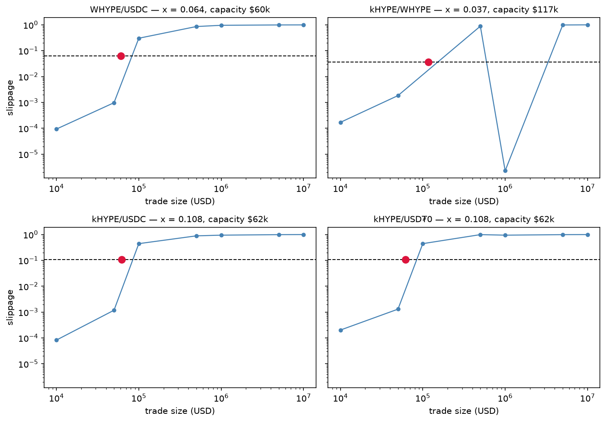
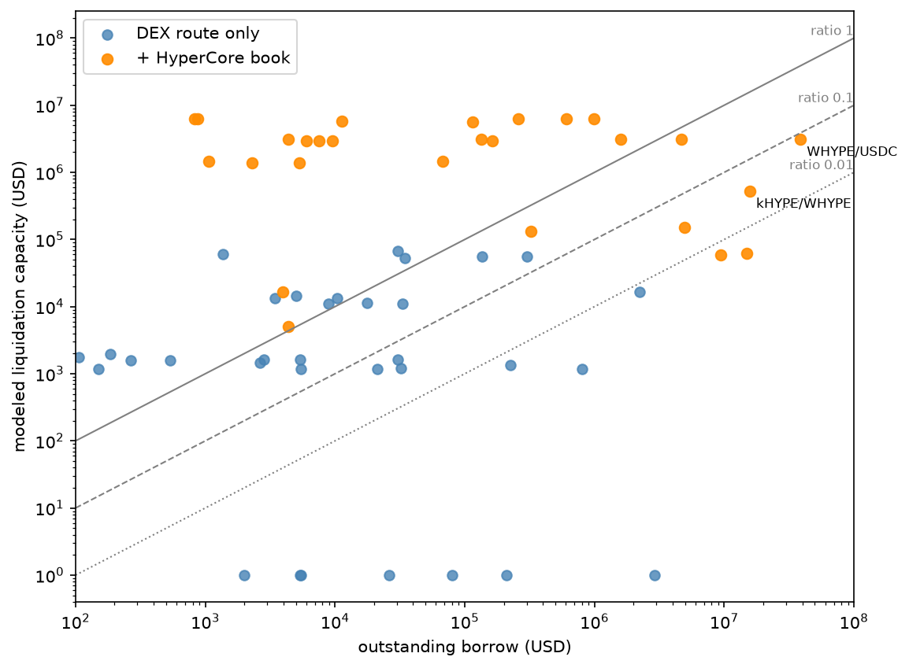
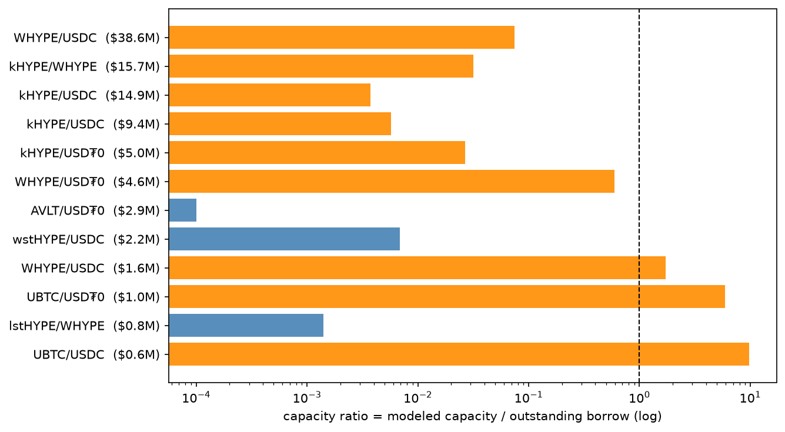

# 03 — Liquidation capacity

## Question

When positions in a HyperEVM market must be liquidated, how much debt can
liquidators actually clear at a profit? Which markets owe more than the
venues around them can absorb?

Scope: every tracked HyperEVM market with a collateral token. This loop
defines the model, applies it to one full quote cycle as a cross-section,
and opens the output table that accumulates the time series. Distributional
statements about capacity over time belong to a later run of this loop.

## Data

The MNEMON snapshot is pinned in `manifest.json`. The model consumes four
inputs and writes one output:

- `dex_quotes` / `v_dex_slippage` — LiquidSwap aggregator route quotes per
  (collateral → loan) pair on a fixed USD ladder (1k, 10k, 50k, 100k, 500k,
  1M, 5M, 10M), hourly. Failed quotes persist with a status: a pair the
  aggregator cannot route has zero swap capacity, and that is data. The view
  derives slippage against the same cycle's $1k rung.
- `core_book_levels` / `v_core_depth` — HyperCore spot order books for the
  three collaterals with a Core listing of the same asset (HYPE, UBTC,
  UETH), stored at four price aggregations per snapshot. The view gives
  cumulative bid-side USD depth within 25/50/100/200/400 bps of mid, from
  the finest book that reaches each band.
- `markets`, `market_state`, `prices` — LLTV per market, outstanding borrow
  ASOF-priced in USD at the quote cycle.
- `outputs/liq_capacity` — the written result, append-only, keyed
  (as_of, market_id, model_version). Every row carries its `params` and
  `input_window` JSON, so any row recomputes from raw inputs alone. The
  notebook re-derives the largest market's row end to end as a check.

Three caveats set the limits of the data:

1. Quotes are aggregator route state, not executed trades. The model
   measures what the router sees, and routing quality bounds it from below.
   Observed liquidator behavior is a separate calibration (a later loop).
2. Venue coverage is one aggregator plus one order book. Any venue the
   model does not see makes true capacity larger, never smaller. Errors
   point in the conservative direction.
3. This cross-section is one cycle. The table accumulates hourly cycles
   under a daily writer, so persistence and time-variation of capacity are
   measurable later, not here.

## Method

A liquidation is a swap with a subsidy. Morpho Blue pays liquidators a
liquidation incentive factor set by the market's LLTV:

    LIF = min(1.15, 1 / (0.3 * LLTV + 0.7))

The liquidator seizes collateral worth LIF times the debt repaid. The gross
margin, as a fraction of seized collateral value, is `1 - 1/LIF` (closed
form `0.3 * (1 - LLTV)` when the 1.15 cap does not bind). Selling the
seized collateral costs slippage. Liquidation stays profitable while
slippage stays below the margin, so the max tolerable slippage is

    x = (1 - 1/LIF) - h

with `h = 0.005`, a haircut for gas, latency and inventory risk. When
`x <= 0` the incentive cannot cover the haircut and modeled capacity is
zero by construction (`zero_threshold`). A high-LLTV market therefore has
tight capacity twice over: less margin per liquidation and a lower
tolerable slippage.

DEX-route capacity is METRON's `liquidation_capacity` on the pair's quoted
slippage ladder: sort by size, interpolate linearly, return the first size
where the curve reaches `x`. Three choices keep the estimate conservative.
Slippage is convex in size, so the linear chord overestimates slippage
between rungs and the crossing lands early. The first crossing decides: a
curve that dips back below the threshold at a larger size does not reopen
capacity. Such dips are real in the data and they are router artifacts, not
liquidity: the aggregator's path search is not monotone in size, and it can
pick a worse route at one rung than at the next (the stored `route_json`
per rung shows which route each quote used). There is no extrapolation: a curve that
never crosses is right-censored at the largest quoted size and the true
capacity is at least the reported value (`capacity_censored`).

Core-book capacity applies only where the collateral's Core spot book
trades the same asset: WHYPE → HYPE, UBTC, UETH. Staked and wrapped
variants (kHYPE, wstHYPE, beHYPE, PT tokens) deliberately do not map — a
liquidator holding kHYPE cannot sell it on the HYPE book without first
unstaking, and that path has its own delay and cost. Core capacity is the
cumulative bid-side USD depth within `x` of mid, interpolated linearly
between the stored bps tiers, anchored at (0, 0) below the first tier and
clamped at the deepest tier. Both ends understate depth — the same
conservatism direction as the DEX leg.

    capacity_total = capacity_evm + capacity_core
    capacity_ratio = capacity_total / outstanding_borrow

Two v1 assumptions are declared in every row's `params`: additivity of the
two venues (their standing inventories are distinct, but arbitrage links
them under stress), and Core mid treated as equivalent to the oracle mark.

Provenance: every row records `model_version` (the METRON tag plus the
risk-engine commit), `params` (haircut, size grid, interpolation and
crossing rules, venues) and `input_window` (the exact as_of of each input
consumed). The table is append-only; a model change writes new rows under a
new version and never rewrites history.

## Results

All numbers come from `notebook.ipynb` over the cross-section cycle; the
charts are saved by the notebook into `assets/`. 65 markets: 57 `ok`, 7
`no_route`, 1 `no_price`; 64 carry outstanding borrow.

### Finding 1 — The DEX route hits a wall near $60k, whatever the pair

Across markets with a routable pair, DEX capacity clusters tightly: median
$11k, p75 $53k, p95 $62k. The four largest markets cross their thresholds
between $55k and $117k, and their slippage curves collapse onto the same
cliff between $50k and $500k despite different pairs and different
thresholds:

Reading: the aggregator's pooled depth, not any market's own parameters,
sets the DEX-route capacity. Doubling the margin (`x` of 0.108 against
0.064) buys almost no extra size — the curves are near-vertical where they
cross. The kHYPE/WHYPE panel shows the first-crossing rule at work. The
quoted curve collapses at $500k, then returns to par at $1M. The stored
routes explain the dip: at $100k and $1M the router selects a direct
kHYPE → WHYPE concentrated-liquidity pool at near-zero impact, while at
$500k and $5M it routes through a kHYPE → USDC leg with about $56k of
effective depth. The recovery at $1M is the router re-finding a route that
also existed at $500k, not liquidity appearing at size. The model refuses
to count the region past the first crossing, which is correct here twice:
the dip is a search artifact, and if the direct pool truly holds that
depth, the reported capacity errs low, never high. The wall raises the
question finding 2 answers: what carries capacity beyond the router?

### Finding 2 — Where a Core book exists, it is the capacity

21 markets have collateral with a Core spot book. For them, the book
contributes 99.5% of modeled capacity: the HYPE book adds $3.2M and the
UBTC book $5.7M of tolerable-slippage depth, against DEX legs of $2k–$68k.
Modeled capacity is, in practice, Core depth wherever Core depth applies.
That makes the mapping rule the load-bearing assumption — and it raises
finding 3: most of the chain's debt sits on collateral that does not map.

### Finding 3 — The largest debt stacks are the least covered

The aggregate hides the problem: $99.2M of outstanding borrow against
$80.4M of modeled capacity reads as ratio 0.8. The distribution inverts it.
31 of 64 markets clear ratio 1, but they are small. The five largest
markets hold 83.9% of the chain's debt and their pooled ratio is 0.043.

The composition of the top of the table:

- kHYPE markets owe $45.9M — nearly half the chain — at ratios between
  0.004 and 0.121. kHYPE has no Core mapping (the HYPE book trades a
  different asset), so its capacity is the $60k DEX wall against
  eight-figure debt.
- WHYPE/USDC, the largest single market at $37.8M, reaches only 0.087 even
  with the HYPE book: `x = 0.064` caps the usable band of the book at
  $3.2M.
- AVLT/USD₮0 owes $2.7M at ratio 0.001: LLTV 0.915 leaves `x = 0.021`, and
  the pair's quoted depth inside that band is $2.3k.

Reading: capacity and debt live on different collaterals. The markets that
would matter in a stress event are precisely the ones the venues cannot
absorb within the protocol's incentive.

### Finding 4 — Zero-capacity rows are findings, not gaps

Seven pairs return `no_route` at every rung: six PT-kHYPE markets and
sUSDe/USH, together owing $0.3M. The aggregator cannot swap these
collaterals at all — a liquidator's exit is redemption or an off-router
venue, both outside this model, so modeled capacity is zero rather than
unknown. One market's whole quoted curve stays below its threshold and is
right-censored: its true capacity exceeds the $10M grid top, and the row
says so instead of guessing.

## Conclusion

The model prices a liquidation as a subsidized swap and asks whether the
subsidy covers the exit. From finding 1: on the DEX route the answer stops
depending on the market almost immediately — the router's pooled depth
walls every pair near $60k, so LLTV-driven margin differences barely move
capacity. From finding 2: real capacity lives where a Core order book
trades the collateral itself, and there it is effectively the whole model.
From finding 3: that mapping fails exactly where the debt is — half the
chain's borrow sits on staked-HYPE collateral whose book does not apply,
and the five largest markets are covered at four cents on the dollar. The
practical output for cap sizing is the ratio column and its status flags:
a market's safe borrow scale is set by its collateral's route to real
depth, not by its LLTV, and the markets that look deepest by TVL are the
least liquidatable per dollar owed. Every number here is conservative by
construction and recomputable from its own row months later; what the
cross-section cannot yet say — how capacity moves, and whether observed
liquidations respect the modeled wall — is what the accumulating table and
the liquidation-replay loop exist to answer.
