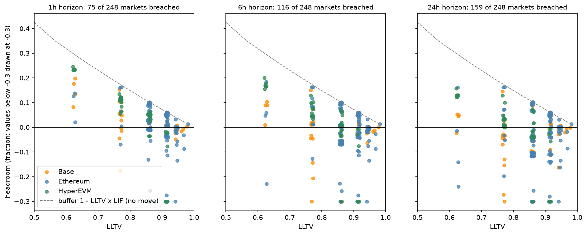
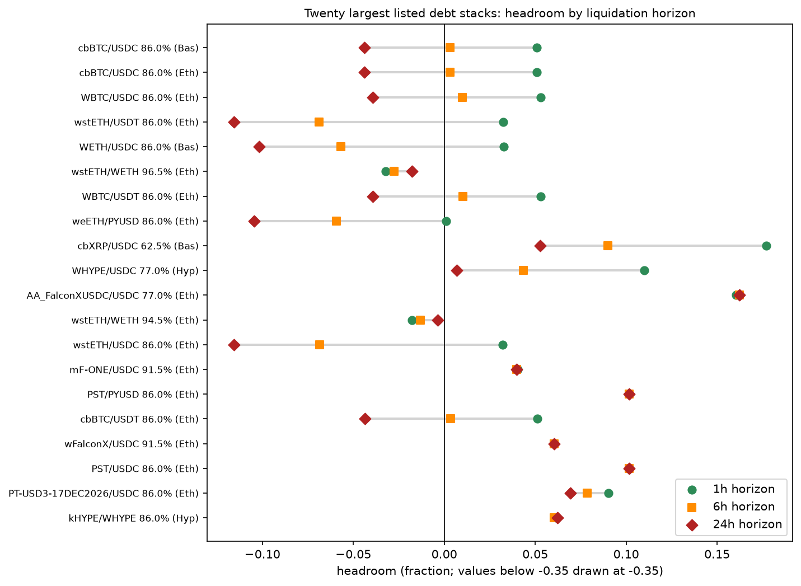
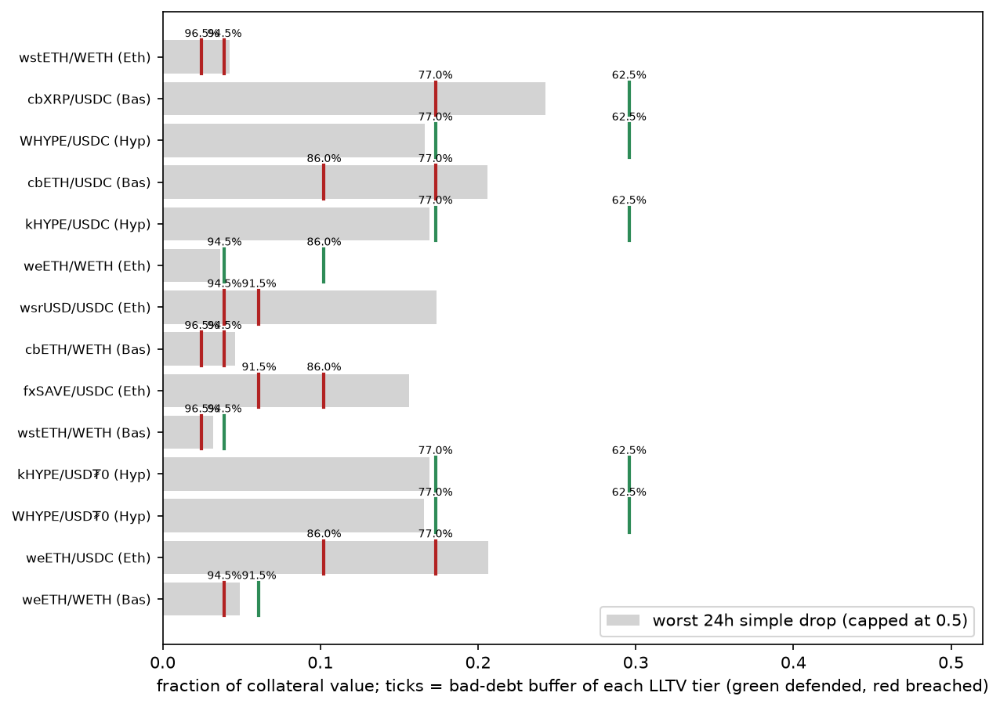
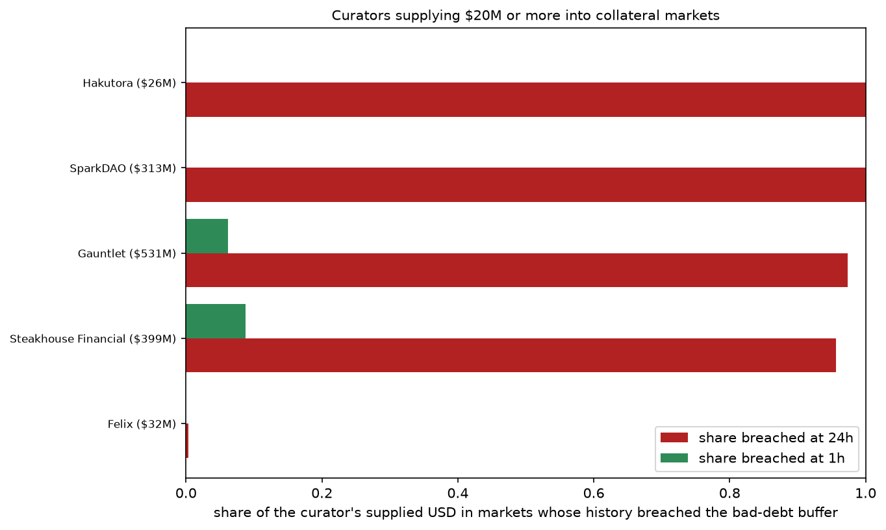

# 04 — LLTV defensibility

## Question

Does the LLTV of each market leave room for the worst collateral move its
price history holds, before the protocol books bad debt? Which curators fund
markets whose history has already breached that room, and where do curators
disagree on the same collateral?

Scope: every market with a collateral token on Ethereum, Base and HyperEVM.
This loop reads one published cross-section of the LLTV defensibility
metrics, interprets it, and compares the curators' allocations against it.
How the verdict changes over time is left to a later run of this loop.

## Data

The MNEMON snapshot is pinned in `manifest.json`. The loop reads five tables
from the snapshot and computes no new statistic:

- `outputs/market_metrics` — the `worst_drop_{1,6,24}h` and
  `lltv_headroom_{1,6,24}h` metrics, written hourly by the risk engine for
  every market. The loop pins one model version and the newest cycle. Every
  row carries its `params` (buffer, LIF, coverage, history length, cleaning
  rule, samples dropped) and `input_window` (history start and end, sample
  count). Any row can be recomputed from the raw inputs alone. The notebook
  rebuilds the largest listed Ethereum market's row end to end as a check.
- `outputs/liq_capacity` — outstanding borrow in USD per market at the
  nearest cycle, used only as a weight.
- `markets` — LLTV, token symbols and decimals, and the `listed` flag of the
  Morpho app. Unlisted markets exist on chain but the app does not show
  them. Some carry synthetic positions: one unlisted PAXG/USDC market
  reports 7.2 billion USDC of borrow equal to its supply. Weighted figures
  are therefore given for listed markets separately.
- `vault_allocations` and `vaults` — how much each tracked vault supplies to
  each market at the latest snapshot, and the vault's display name.
- `prices` — hourly USD prices of both legs, for the recomputation check and
  for the USD value of the vaults' supply.

One input comes from outside the snapshot. The curator behind each vault is
read from the curator registry of the Morpho API (`vaults.state.curators`
for V1 vaults, `vaultV2s.curators` for V2 vaults). The notebook fetches the
registry once and saves it as `assets/vault_curators.csv`, so the loop can
be rerun without the API.

Three caveats set the limits of the data:

1. The price history is hourly. It starts on 2025-01-01 for Ethereum and
   Base and on 2025-04-25 for HyperEVM. It holds the crypto-wide crashes of
   2025-02-03, 2025-10-10 and 2026-02-05, the 2025-11 deUSD collapse and
   the 2026-03-22 Resolv depeg. It does not hold 2022.
2. The feeds carry artifacts: one-hour ticks and short plateaus at wrong
   prices, and decimal-scale garbage for some self-priced tokens. The
   engine removes them with two declared rules (Method). What survives is
   what the feed said.
3. During the live period the two legs of a pair are sampled at different
   minutes within the hour. In a fast market this alone produces a few
   percent of apparent cross-rate move. Pairs whose buffer is a few percent
   sit at the resolution limit of the data.

## Method

### What the metric is

A liquidation on Morpho Blue repays debt and seizes collateral worth LIF
times the repaid debt, with `LIF = min(1.15, 1 / (0.3 x LLTV + 0.7))`. A
position at the liquidation threshold holds collateral worth `debt / LLTV`.
A liquidation at that point covers the debt while the collateral is worth at
least `LIF x debt`. The protocol books bad debt once the collateral has
fallen by more than

    buffer = 1 - LLTV x LIF

since the threshold. At 86% LLTV the buffer is 10.2%; at 96.5% it is 2.5%.

A worked example, with the cbBTC/USDC market at 86% LLTV on Ethereum. A
borrower at the threshold owes 100 USDC and holds cbBTC worth 116.3 USDC.
The LIF at 86% is 1.044, so a liquidator who repays the 100 USDC takes cbBTC
worth 104.4 USDC. The position can lose 116.3 - 104.4 = 11.9 USDC of
collateral value, 10.2% of 116.3, before a liquidation stops covering the
debt. That 10.2% is the buffer. If cbBTC falls 14.6% before anyone
liquidates, the collateral is worth 99.3 USDC. The liquidator takes all of
it and repays 99.3 / 1.044 = 95.1 USDC. The remaining 4.9 USDC of debt is
bad debt.

The collateral is priced in loan units: `collateral_usd / loan_usd`, last
price per hour, on the hours where both legs have a price. A USD series is
the wrong input for a correlated pair such as wstETH/WETH or kHYPE/WHYPE. It
inherits the loan asset's volatility and misses the depeg that liquidates.
The cross rate also catches loan-side events. A loan stablecoin that depegs
and rebounds appears as a drop of the collateral in loan units, which is the
shock the market's oracle marks.

`worst_drop_{tau}h` is the most negative cumulative log return over any
window of tau consecutive hourly samples in the whole stored history, for
tau of 1, 6 and 24 hours. It answers one question: in the worst tau hours
the history holds, how far did the collateral fall against the loan asset?
`lltv_headroom_{tau}h` is the buffer minus that fall, expressed as a simple
return: `buffer - (1 - exp(worst_drop))`. Positive headroom means the
history never breached the buffer at that horizon. Negative headroom means
it did.

The same example, continued. The history holds 14,768 hourly prices of
cbBTC in USDC. The worst single hour dropped the price by about 5.1%. The
worst run of six consecutive hours dropped it by about 9.9%. The worst run
of twenty-four consecutive hours dropped it by 14.6% (`worst_drop_24h` =
-0.158 in log terms). Against the 10.2% buffer, the headroom is +5.1% at
one hour, +0.3% at six hours and -4.4% at twenty-four hours. A liquidation
of this market that completes within six hours of the threshold crossing
would have covered its debt through every move in the history. A
liquidation that takes a day would not.

### Guards and cleaning rules

A market gets no verdict when its history is shorter than 90 days or when
fewer than 90% of the hour slots between its first and last sample hold a
price. The measured values are in the row's params.

Two rules clean the feed before anything is computed. The first removes
short excursions. A run of at most three samples is dropped when it sits
more than 0.5 log units away from both the sample before it and the sample
after it, in the same direction, and those two samples agree within 0.2 log
units. In plain terms: a 65% move that fully returns within three hours is
a feed tick, not a price. Moves that persist, or that do not return, are
kept. The second rule excludes prices below one millionth of a dollar. Both
rules and the number of samples they removed are in the row's params.

### The verdict

A market is *defensible* at a horizon when its headroom is strictly
positive and *breached* when it is negative. The horizon stands for the time
a liquidation takes after a position crosses the threshold. One hour is a
liquid collateral with a working oracle and active keepers. Six or
twenty-four hours is a liquidation that waits for capacity, for an oracle
update, or for a keeper.

Liquidation costs are not subtracted from the headroom in this run. The
slippage a liquidator pays at the observed capacity (loop 03) and the
deviation of the market's oracle from the reference price both reduce the
room. Headroom is therefore an upper bound on defensibility. The rows say
so (`costs: none`).

### The curators' benchmark

Morpho Blue markets are permissionless. Anyone can create a market with one
of the LLTVs the protocol allows, and anyone can supply to an existing
market. A curator therefore chooses an LLTV twice: when it creates a market
and when it funds one. The latest `vault_allocations` snapshot gives the
markets each vault supplies and how much. The supply converts to USD with
the loan asset's latest price. The curator of each vault comes from the
registry described in Data. Two vaults the registry does not name take the
first word of their name as label. The benchmark is the share of each
curator's supplied USD, among markets with a verdict, that sits in markets
whose history breached the buffer, at 1h and at 24h. Where two curators
fund different LLTV tiers of the same pair, the tiers and their verdicts are
listed.

## Results

All numbers come from `notebook.ipynb` over one cross-section cycle; the
charts are saved by the notebook into `assets/`. The three chains hold 515
markets with a collateral: 324 on Ethereum, 125 on Base, 66 on HyperEVM.

### Finding 1 — The horizon decides the verdict more than the LLTV does

248 markets carry a verdict at every horizon. At 24h, 159 of them are
breached: 100 of 147 on Ethereum, 43 of 56 on Base, 16 of 45 on HyperEVM.
At 6h, 116 are breached: 73 on Ethereum, 31 on Base, 12 on HyperEVM. At 1h,
75 are breached: 52 on Ethereum, 13 on Base, 10 on HyperEVM. Weighted by
borrow over listed markets, 87.1% of $2,763M sits in markets breached at
24h and 6.4% in markets breached at 1h.

The dashed line is the buffer at each LLTV. A market whose collateral never
dropped against its loan asset would sit on the line. Each market sits
below the line by the worst drop of its pair at that horizon. From left to
right the points move down: the longer the window, the larger the worst
drop it contains. The 86% tier, where most of the debt lives, has a 10.2%
buffer. The worst 24h drops of BTC and ETH against USD in the history are
14.6% and 20.4%. That tier is breached at 24h for every BTC and ETH
market. The 62.5% tier has a 29.6% buffer, and almost every market there is
defensible at every horizon. The next finding asks at which horizon the
large markets change verdict.

### Finding 2 — The large markets change verdict between one and six hours

For the twenty largest listed markets by borrow:

- cbBTC/USDC at 86% on Base, the largest market at $1,390M: headroom +5.1%
  at 1h, +0.3% at 6h, -4.4% at 24h. WBTC/USDC on Ethereum reads the same:
  +5.3%, +1.0%, -3.9%. A BTC market at 86% is defensible if liquidation
  completes within about six hours of the threshold crossing, and not
  otherwise.
- The ETH markets at 86% change verdict earlier. wstETH/USDT reads +3.3% at
  1h, -6.9% at 6h, -11.6% at 24h; WETH/USDC on Base +3.3%, -5.7%, -10.2%;
  weETH/PYUSD +0.1%, -5.9%, -10.5%. These markets are defensible only if
  liquidation completes within one hour.
- The stablecoin and RWA collaterals with a USD loan (AA_FalconXUSDC,
  mF-ONE, PST, wFalconX) read the same positive headroom at every horizon.
  Their history holds no move of the size of their buffer.
- cbXRP/USDC at 62.5% and WHYPE/USDC at 77% are defensible at every horizon
  with +5.3% and +0.7% left at 24h.
- wstETH/WETH at 96.5% ($77M) and at 94.5% ($26M) are breached at every
  horizon, by 0.4% to 3.2%. Their buffers are 2.5% and 3.9%. The worst
  moves measured, 4.3% to 5.7%, are within the resolution limit set by the
  two legs' sampling (Data, caveat 3). The data cannot judge these two
  markets. A verdict on them needs both legs sampled at the same minute.

Across the three chains, 87 markets are defensible at 1h and breached at
24h; the 63 listed ones hold $2,230M of borrow. 75 markets are breached
even at 1h. They are the collapsed or depegged collaterals (RLP, USR,
AVLT, deUSD-based tokens, USUALX), the PT tokens of those, volatile
long-tail tokens against USDC (EIGEN, KTA, TOSHI), LsETH, and the LST/WETH
and BTC/BTC pairs at 91.5% to 96.5%. For most of the borrow, the 24h
verdict is a statement about liquidation latency, not about the LLTV alone.
The next finding looks at pairs that trade at two LLTVs at once, and asks
whether the worst drop falls between the two buffers.

### Finding 3 — Where one pair trades at two LLTVs, the history defends the lower one

This finding uses the 24h horizon, the strictest of the three.

25 pairs trade at two or more LLTVs. The worst drop is a property of the
pair. The buffer is a property of the LLTV tier. When the worst drop is
smaller than every tier's buffer, every tier is defensible. When it is
larger than every buffer, no tier is. When it falls between two buffers,
the lower tier is defensible and the higher one is breached. The 24h
history defends every tier on 10 pairs and no tier on 9. On 6 pairs the
worst drop falls between the tiers:

- cbXRP/USDC on Base: the worst 24h drop is 24.3%. The 62.5% tier's buffer
  of 29.6% holds; the 77% tier's 17.3% does not.
- UBTC/USD₮0, UBTC/USDe and UETH/USD₮0 on HyperEVM: worst drops of 13.8% to
  14.5% fall between the 77% tier's 17.3% and the 86% tier's 10.2%.
- wstETH/WETH and weETH/WETH on Base: drops of 3.2% and 4.9% fall between
  the 94.5% and 96.5% tiers, and between the 91.5% and 94.5% tiers. These
  are the resolution-limit pairs of finding 2.

On HyperEVM the worst drop of BTC and ETH collateral falls exactly between
the two tiers in use, 77% and 86%. The history alone, without a model,
separates the two. The next finding asks which tiers the curators fund.

### Finding 4 — The large curators fund markets breached at 24h, except on HyperEVM

74 vaults on the three chains supply $1,357M into collateral markets,
under 16 curators. Five curators supply $20M or more:

- Gauntlet ($531M, 27 vaults, 75 markets): 97.3% of its judged supply sits
  in markets breached at 24h, 6.1% in markets breached at 1h.
- Steakhouse Financial ($399M, 13 vaults, 59 markets): 95.7% at 24h, 8.7%
  at 1h. 90% of its supply has a verdict; the rest sits in markets without
  one.
- SparkDAO ($313M, 2 vaults, 3 markets): 100% at 24h, 0% at 1h. Its three
  markets are the BTC and ETH majors at 86%.
- Felix ($32M, 4 vaults, 20 markets, HyperEVM): 0.3% at 24h and 0% at 1h.
  Its markets are HYPE collateral at 62.5% and 77% and BTC at 77%, the
  tiers finding 3 found defended.
- Hakutora ($26M, 2 vaults, 3 markets): 100% at 24h, 0% at 1h.

Below $20M, Yearn ($18M) sits 57.7% at 24h and 17.0% at 1h, Anthias Labs
($10M) 71.1% and 14.6%, MEV Capital ($8M) 85.8% at both horizons.

13 pairs are funded at two different tiers by different curators. On most
of them the higher tier holds little money. cbXRP/USDC on Base carries
$3.5M at 62.5% (defensible, from Clearstar, Gauntlet, Steakhouse Financial
and Yearn) and $0.1M at 77% (breached). UBTC/USD₮0 on HyperEVM carries
$0.6M at 77% (defensible, Felix and Gauntlet) and $0.1M at 86% (breached,
Felix). weETH/WETH on Base carries $0.1M at 91.5% (defensible, Gauntlet)
and $1.3M at 94.5% (breached, Anthias Labs). The exception is wstETH/WETH
on Ethereum: $57.3M at 96.5% from five curators against $0.6M at 94.5%
from four. Both tiers read breached, and both sit at the resolution limit.

The 86% tier for BTC and ETH against USD is defensible only if liquidation
completes within one to six hours. Every large curator funds that tier. The
one large curator whose book the 24h history defends is Felix, on HyperEVM,
at 62.5% and 77%. HyperEVM has the thinnest liquidation venues of the three
chains (loop 03). The lower LLTV compensates for the thin venue, and the
history says the compensation is sufficient.

### Finding 5 — 267 markets have no verdict

267 of the 515 markets carry no verdict at 24h. 188 have hourly coverage
below 0.9 on at least one leg. 54 have no priced leg at all. 25 are younger
than 90 days. The sparse legs are long-tail tokens lending USDC, WETH or
EURCV: wstHYPE, sUSDe, cbBTC pairs with an exotic loan asset, PT tokens.
The cleaning rules removed samples from 47 of the 515 series, at most 24
samples from one. The metric reaches every market whose two legs an hourly
price feed covers, and no further.

## Conclusion

The metric asks whether a liquidation at the threshold would have covered
its debt through the worst move the collateral has made against the loan
asset. From finding 1: the answer depends on the horizon more than on the
LLTV. At 24 hours the history breaches the 86% tier for every BTC and ETH
market and 87% of the listed borrow. At one hour it defends 94% of that
borrow. From finding 2: the large markets change verdict between one and
six hours. BTC at 86% holds through six hours; ETH at 86% needs one. The
LST pairs against WETH at 94.5% and 96.5% sit at the resolution limit of
hourly two-leg data and cannot be judged with it. From finding 3: where one
pair trades at two LLTVs, the pair's worst drop separates the tiers, and on
HyperEVM it falls between the 77% and 86% tiers in use. From finding 4: the
large curators' books are 96% to 100% in markets breached at 24h and 0% to
9% in markets breached at 1h. They fund the standard tiers, and the
standard tiers hold only with fast liquidation. The one large book the 24h
history defends is on HyperEVM at 62.5% and 77%. From finding 5: 267 of 515
markets have no verdict, because no hourly feed prices their legs.

The practical output is a requirement rather than a number. An LLTV is
defensible if liquidation completes within the horizon at which its
headroom turns negative. For the largest markets that horizon is one to six
hours, and loop 03 measures whether the venues can clear the debt in that
time. Headroom is an upper bound: it subtracts no liquidation cost. The next
run of this loop subtracts the slippage at the observed capacity and the
oracle's deviation from the buffer, and samples both legs at the same
minute so the high-LLTV pairs get a verdict.
